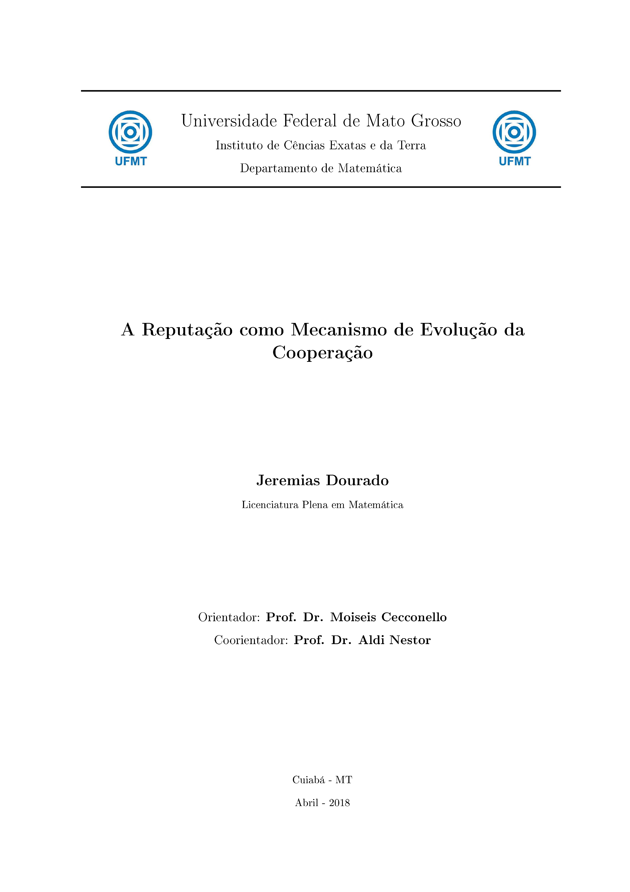

Monografia defendida no curso Licenciatura Plena em Matemática da Universidade Federal de Mato Grosso, como parte dos requisitos para obtenção do título de LICENCIADO EM MATEMÁTICA.

# A Reputação como Mecanismo de Evolução da Cooperação

 
- <h3> Aluno: <b> Jeremias Dourado </b></h3> 
- <h3> Número da Matrícula: <b> 201211306014 </b> </h3>
- <h3> Área de Concentração: <b> Matemática </b> </h3>
- <h3> Linha de Pesquisa: <b> Teoria dos Jogos Evolutivos </b> </h3>
- <h3> Orientador: <b> Prof. Dr. Moiseis dos Santos Cecconello </b> </h3> 
- <h3> Coorientador: <b> Prof. Dr. Aldi Nestor de Souza </b> </h3> 

<h4>
Esta monografia foi APROVADA em reunião pública realizada na Sala 80 do Instituto de Ciencias Exatas e da Terra, Universidade Federal de Mato Grosso, em 04 de fevereiro de 2018, às 9h, pela seguinte Banca Examinadora: 

- Prof. Dr. Moiseis dos Santos Cecconello da UFMT - Universidade Federal de Mato Grosso 
- Prof. Dr. Andre Krindges da UFMT - Universidade Federal de Mato Grosso
- Prof. Dr. Almir Cesar Ferreira Cavalcanti da UFMT - Universidade Federal de Mato Grosso
- Prof. Dr. Aldi Nestor de Souza da UFMT - Universidade Federal de Mato Grosso
</h4>

